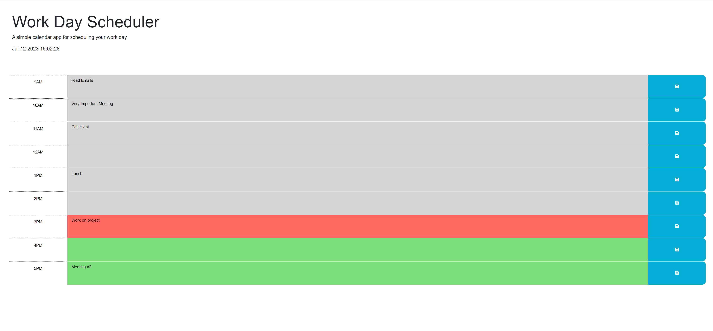

# Daily Planner

## Table of Contents

- [Description](#description)
- [Features](#features)
- [Usage](#usage)
- [Screenshot](#screenshot)
- [License](#license)

## Description

The Daily Planner is a simple web application designed to help users manage their time effectively by providing a convenient way to add and organize important events throughout the day. With an intuitive interface, it allows users to easily plan and schedule their daily activities, ensuring they stay organized and productive.

## Features

- **Hourly Planning**: The planner displays hours of the day, allowing users to allocate specific events to each hour.
- **Event Storage**: Events can be saved and retrieved from local storage, ensuring that the schedule remains intact even after refreshing or reopening the application.
- **Real-time Clock**: The current date and time are displayed at the top of the planner, giving users a quick reference for their scheduling.
- **Dynamic Styling**: The time blocks dynamically update their appearance based on the current hour, providing visual cues to easily distinguish past, present, and future events.

## Usage

To access the Daily Planner, click [here](https://sernat243.github.io/Daily-Planner/) to launch the application in your web browser. Once the planner is loaded, follow these steps:

1. Scroll through the planner to view the different hours of the day.
2. Click on the textarea within each time block to enter and save your event or task for that hour.
3. To save an event, click the "Save" button associated with the respective time block.
4. The saved events will persist even if you close or refresh the page, ensuring that your schedule remains intact.

## Screenshot

## License

This project is licensed under the [MIT License](LICENSE).